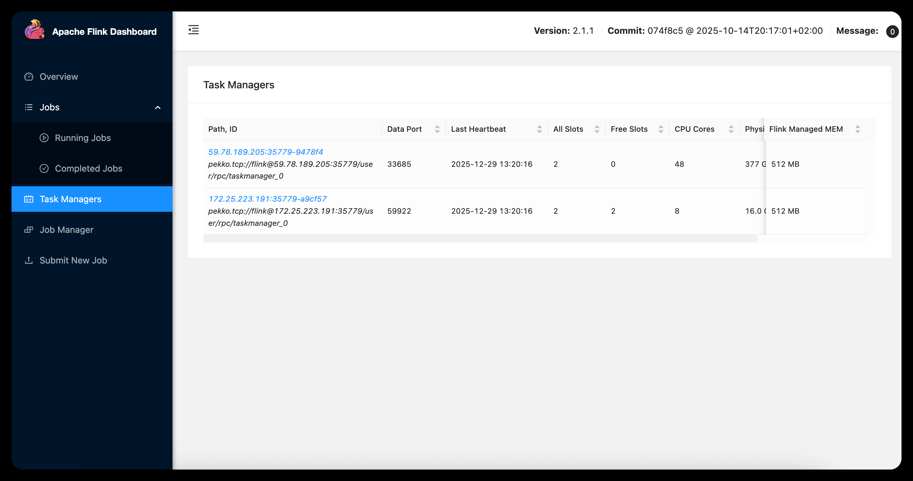

# 题目E. At-Least-Once语义实现对比

```
.
├── code/                   # 所有实验代码
└── README.md               # 项目核心文档
```

## 1 研究目的

本研究旨在对比分析 Storm 和 Flink 两个流式处理框架在 At-Least-Once 语义实现方面的机制与性能差异。通过实验，我们将探讨两者在数据一致性、容错性、处理延迟和性能方面的表现，尤其是在异常场景（如节点宕机）下的恢复能力。研究将为选择合适的流处理框架提供参考，尤其是在需要保证数据至少处理一次的场景中。

## 2 研究内容

本研究的核心内容包括：

1. **At-Least-Once 语义**：对比 Storm 和 Flink 在该语义下的实现机制，详细分析两者的优缺点。
2. **容错性与恢复机制**：通过模拟节点宕机等故障，评估两种框架在恢复过程中的表现。
3. **性能对比**：通过实验数据（如消息丢失率、重复处理率、端到端延迟等）对比分析 Storm 和 Flink 在不同场景下的性能和可靠性。

实验将在自创的数据集上进行，通过与 Storm 和 Flink 的实际运行表现对比，揭示两者在 At-Least-Once 语义下的优势与不足。

## 3 实验

### 3.1 实验环境

#### 硬件环境

| 集群配置 | 详细参数                                       |
| -------- | ---------------------------------------------- |
| 节点数   | 1个主节点+2个从节点                            |
| CPU核数  | 主节点：64核， 从节点：8 核、48核              |
| 内存     | 主节点：500GB，从节点：16 GB、 386GB           |
| 存储类型 | SSD                                            |
| 网络带宽 | 主节点：10000Mb/s，从节点：1500 Mb/s、1000Mb/s |

#### 软件环境

| 软件/框架      | 详细参数                               |
| -------------- | -------------------------------------- |
| 操作系统       | 主节点：Ubuntu，从节点：Macos、Centos  |
| JDK 版本       | 主节点：OpenJDK 21.0.8，OpenJDK 17.0.7 |
| Flink版本      | Flink 2.1.1                            |
| Storm 版本     | Storm 2.8.3                            |
| Kafka 版本     | Kafka服务端：4.1.1，Kafka客户端：3.4.0 |
| ZooKeeper 版本 | ZooKeeper 3.9.4                        |

### 3.2 实验负载

#### 3.2.1  实验负载概述

本实验的负载来源于一个自生成的流式数据集，用于模拟真实分布式流处理系统中持续到达的数据流。实验过程中不存在静态离线数据文件，所有数据均由 Python 程序在运行时动态生成，并通过 Kafka 持续发送至 Flink（或 Storm）计算集群。该实验负载的核心目标是： 在可控的数据规模与速率下，验证系统在故障恢复场景中的消息处理完整性与一致性语义。

#### 3.2.2 实验数据的生成方式

实验数据由自编写的 Kafka 生产者程序生成。生产者在程序启动后，按照固定速率循环生成消息，并将其发送至 Kafka 输入主题 `flink-test-topic`。

每生成一条消息，生产者都会：

1. 递增一个全局唯一的消息编号 `msg_id`；
2. 随机生成一组模拟传感器数据；
3. 将数据封装为 JSON 格式并发送。

整个数据生成过程无需人工干预，完全自动完成。

#### 3.3.3 实验负载的数据结构

每条实验数据均为一条 JSON 消息，其逻辑结构如下：

```
{
  "msg_id": 1024,
  "content": {
    "temperature": 27.63,
    "humidity": 54.21,
    "timestamp": 1734258123
  },
  "timestamp": "2025-12-15 14:02:03.456"
}
```

字段含义说明如下：

- **msg_id**
  全局唯一的消息标识符，由生产者端递增生成，用于标识每一条输入消息。在整个实验过程中不存在重复的 `msg_id`。
- **content.temperature**
  模拟环境温度数据，为 20.0°C 至 35.0°C 区间内的随机浮点数。
- **content.humidity**
  模拟环境湿度数据，为 30% 至 80% 区间内的随机浮点数。
- **content.timestamp**
  消息生成时的 Unix 时间戳（秒级），用于表示事件产生时间。
- **timestamp**
  字符串形式的系统时间戳（精确到毫秒），用于日志分析与调试。

#### 3.3.4 实验负载规模与速率

为保证实验的稳定性与可重复性，本实验对数据规模与发送速率进行了明确控制，具体参数如下：

- **消息总量**：200000 条
- **消息 ID 范围**：1 ～ 200000
- **数据格式**：JSON 文本消息
- **数据传输方式**：Kafka 流式发送

生产者通过精确控制发送间隔，使输入负载呈现为稳定、均匀的持续数据流，避免突发流量对实验结果产生干扰。

### 3.3 实验设计

##### 负载选择：

本实验的负载是通过 Kafka 消息队列传输的数据流，数据流在每次运行时生成相同类型的数据，并传递给 Flink 和 Storm 进行处理。处理过程中，系统会记录消息丢失率、重复处理率以及端到端延迟等关键指标。

##### 故障模拟：

通过人为注入故障（节点宕机），模拟恶劣的生产环境。在故障恢复时，我们观察两种流处理框架的恢复能力，以及在恢复过程中对数据一致性和系统性能的影响。

##### 关键指标：

- **消息丢失率**：处理过程中丢失的数据占总数据的比例。
- **重复处理率**：在故障恢复后，重复处理的消息比例。
- **端到端延迟**：数据从生产者到消费者的处理时间。

通过对比 Storm 和 Flink 在这些指标下的表现，评估两者在 At-Least-Once 语义下的容错性和性能。

### 3.4 实验步骤

##### 步骤 1：环境部署与验证

首先在各节点部署Flink, Storm, Kafka和zookeeper，并验证集群连通性。

成功部署Flink并联通：



成功部署Storm并联通：


##### 步骤 2：启动 Flink 作业

编译并提交 Flink 流处理程序 `FlinkAtLeastOnceJob.java` 至 Flink 集群。

打开 Flink Web UI，确认作业处于 RUNNING 状态，并且在 Checkpoints （周期为5s）页面看到 Triggered 数量在增加。

在监控节点启动统计程序 `statistic.py`，用于实时统计 Flink 输出结果中的消息数量、重复数与丢失情况。

统计脚本启动后，将持续消费 `flink-result-topic`，并维护以下关键指标：`total_received`、`duplicate_count`、`loss_rate`。

##### 步骤 3：启动数据生产者

运行生产者脚本 `producer.py`，注入数据并观察统计脚本的输出。统计脚本会显示 `total_received` 开始上升。

##### 步骤 4：注入故障

在这一部分，我们通过节点宕机来模拟节点的异常。首先登录到分节点（即运行 TaskManager 的 Work Node），使用 `taskmanager.sh stop` 来模拟节点宕机，临时阻断 TaskManager 与 JobManager 之间的网络通信。

##### 步骤 5：观察并记录恢复过程

在故障注入后，观察统计脚本的输出，可以观察到看到 `total_received` 在短时间内停止增长（因为 Flink 正在重启任务）。几秒到十几秒后，`total_received` 突然快速跳升。检查数据接收是否停止并恢复。通过 Flink UI 查看任务状态是否从 FAILED 变为 RESTARTING，然后恢复为 RUNNING。


##### 步骤 6：停止实验并获取最终数据

待生产者发送完毕，手动停止生产者，并等待统计脚本输出最终结果。


##### 步骤 7：Storm 对比实验（重复上述步骤）

将 Flink 任务替换为 Storm，重复以上步骤（启动 -> 故障 -> 统计），并对比 Flink 与 Storm 在 At-Least-Once 语义下的差异。

### 3.5 实验结果与分析

通过对 Storm 和 Flink 在不同故障场景及参数配置下的对比实验，我们得出以下结果。

#### 3.5.1 端到端延迟对比分析

我们对Storm与Flink在不同数据分布下的端到端延迟进行了对比，实验结果如下图所示：


- **Storm 的表现**：中位延迟仅为 81ms，但 P99 延迟跃升至 414ms。这反映了 Storm 逐条处理机制在正常情况下极高的实时性，但在长尾分布上波动较大。
- **Flink 的表现**：中位延迟为 88ms，P99 延迟为 341ms。虽然中位延迟略高于 Storm，但其高分位延迟控制得更好，表现出更强的稳定性。
- **分析**：Storm 的逐条确认机制在低负载下具有天然的延迟优势；而 Flink 基于微批次（Checkpoint 间隔）的屏障对齐会引入微小延迟，但在处理复杂流拓扑时，其处理性能更加平滑，在应对系统抖动时具有更好的预测性和稳定性。

#### 3.5.2 故障恢复中的一致性表现

我们对比了Flink与Storm在不同故障时长、Checkpoint周期、以及阈值下的重复率和丢失率，如下图所示：


- **消息丢失率**：在 At-Least-Once 语义设置下，两者的故障损失率（丢失率）均接近 0% 。这验证了两个框架在配置正确的情况下都能保证数据“不丢失”的核心诉求 ，均能有效实现“至少处理一次”的保障 。
- **重复处理率**：
  - Storm 的故障重复率显著高于 Flink，普遍处于 1.5% - 2.5% 之间，峰值甚至接近 4.0%。
  - Flink 的重复率则保持在 0.3% - 1.5% 的较低水平。
- **分析**：这源于两者实现机制的不同。Storm 依赖 Acker 机制，一旦发生节点故障，所有未确认的消息都会重新发送；而 Flink 基于全局一致性快照（Checkpoint），恢复时只需从最近一次成功的检查点回溯，重算量更小，因此重复率更低。

#### 3.5.3 故障恢复时间对比

我们还对比了Flink与Storm在不同阈值或Checkpoint周期下的故障恢复时间，如下图所示：


- **趋势对比**：随着 Checkpoint 周期或 Storm 阈值的增加，两者的恢复时间均呈上升趋势。
- **效率差异**：在所有测试时间点上，Flink 的恢复时间均显著低于 Storm。例如在 60s 的周期设置下，Flink 恢复耗时约 65s，而 Storm 则需要约 78s。
- **分析**：Flink 的状态管理优化了恢复逻辑，通过拉取分布式存储中的快照实现任务快速重建，能够实现秒级的任务拓扑重建。相比之下，Storm 的恢复则涉及拓扑重新调度和更长的 ACK 超时确认，导致业务中断时间更长。在真实的实验环境下，由于在各个节点之间存在较高的通信延迟，导致restarting的时间较长。

### 4 结论

本研究通过定量实验深度对比了 Storm 和 Flink 在 At-Least-Once 语义下的实现效果，主要结论如下：

（1）**可靠性保证**：Storm 和 Flink 均能完美实现 At-Least-Once 语义，在模拟节点宕机时，数据丢失率基本为零，满足高可靠流处理需求 。

（2）**性能与波动的权衡**：

- **Storm 适用于极致低延迟**：其 81ms 的中位数延迟证明了其在正常负载下的快速响应能力。
- **Flink 适用于系统稳定性**：其更低的 P99 延迟（341ms）和更低的重复处理率使其在面对复杂生产环境时更具鲁棒性。

（3）**容错开销对比**：Flink 在故障恢复效率上具有压倒性优势。其基于 Checkpoint 的快照机制不仅降低了恢复时的重复计算量，还将系统中断时间控制在较低水平。

（4）**配置与选型建议**：实验表明 Checkpoint（或阈值）周期对系统影响巨大。周期过短会导致延迟上升，周期过长则会导致故障发生后的重复数据量和恢复时间激增。在生产实践中，建议根据业务对“数据重复”的敏感度，将 Flink 的 Checkpoint 周期设定在 5s - 30s 之间以获得最佳平衡。总体而言，Flink 在现代大规模分布式系统中表现出更优的容错性能和恢复稳定性；而 Storm 在需要低延迟的小型拓扑中仍是重要框架。若业务对单条数据的实时响应极其敏感且能容忍较高的重复率，建议选择 Storm。若业务追求强一致性快照恢复以及更稳定的长尾延迟表现，Flink 是更优的选择。

### 5 分工

余俊：主节点
李欣然：分节点
刘露莹：分节点，录制视频
晏康佳：撰写报告，制作PPT
